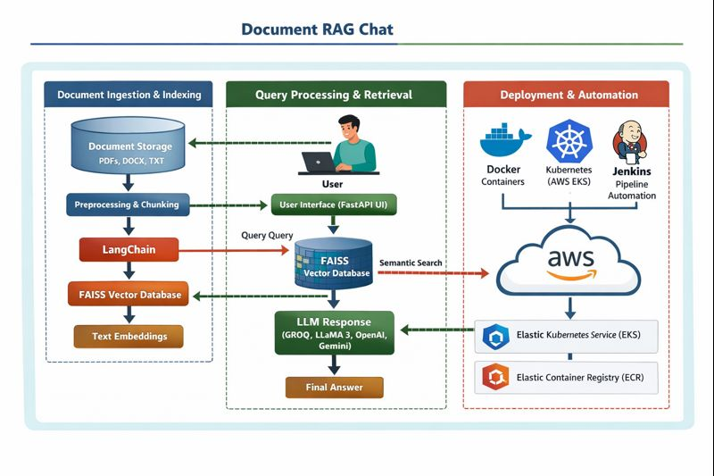

# MultiDocChat — Document RAG Chat (FastAPI + FAISS + Docker + EKS/ECR + Jenkins)

MultiDocChat is a lightweight **document-based chat application** using **RAG (Retrieval-Augmented Generation)**.

Users can upload documents (**PDF / DOCX / TXT**), build a **session-specific** vector index (**FAISS**), and chat with an LLM using **retrieved context** (including MMR-style retrieval in the ingestion pipeline).

## System Architecture



---


## Live App (AWS)

**Hosted URL (AWS LoadBalancer / ELB):**
```text
http://a45f7849dbdec43c9b4798b9228a0efb-656026200.eu-north-1.elb.amazonaws.com/
```

To fetch the current URL from your cluster:
```bash
kubectl get svc multi-doc-chat-service   -o jsonpath="{.status.loadBalancer.ingress[0].hostname}"
echo
```

---

## What’s inside this repo

This repository includes:

- **FastAPI backend** serving both **API + UI**
- Document ingestion & chunking pipeline (**LangChain**)
- **FAISS** vector store per upload session (`faiss_index/<session_id>/...`)
- Containerization with **Docker**
- Deployment to **AWS EKS**, images stored in **AWS ECR**
- **Jenkins pipelines** for build/test/push/deploy automation
- GitHub Actions workflows for CI/CD checks

---

## LLM Providers (GROQ / OpenAI / Gemini)

### Default: GROQ + Llama 3.1 8B
The app is set up to work great with **GROQ** using a **Llama 3.1 8B** class model (commonly configured as `llama-3.1-8b-instant`).

### Switching to OpenAI or Gemini
The project is designed so you can easily switch providers by changing configuration/environment variables (your `ModelLoader` reads the provider + keys and loads the appropriate client).

Typical pattern:
- `LLM_PROVIDER=groq` uses `GROQ_API_KEY`
- `LLM_PROVIDER=openai` uses `OPENAI_API_KEY`
- `LLM_PROVIDER=gemini` uses `GOOGLE_API_KEY`

---

## Architecture (High-Level Flow)

1. **User uploads** one or more files via the UI (or `/upload`)
2. Backend:
   - Saves files into a **session folder**: `data/<session_id>/...`
   - Loads documents (PDF/DOCX/TXT)
   - Splits into chunks (RecursiveCharacterTextSplitter)
   - Embeds chunks using the configured embeddings model/provider
   - Writes a **FAISS** index to: `faiss_index/<session_id>/...`
3. **User chats** via UI (or `/chat`)
4. Backend:
   - Loads the FAISS index for that session
   - Retrieves top chunks
   - Sends retrieved context to the LLM
   - Returns the answer

---

## API Endpoints

### Health
- `GET /health` → `{ "status": "ok" }`

### UI
- `GET /` → serves the frontend (Jinja templates + static assets)

### Upload documents
- `POST /upload`
  - `multipart/form-data`
  - field: `files` (one or multiple files)
  - returns: `session_id`

Example with curl:
```bash
curl -F "files=@/path/to/doc.pdf"      -F "files=@/path/to/notes.txt"      http://localhost:8080/upload
```

### Chat
- `POST /chat`
  - JSON body:
    ```json
    { "session_id": "...", "message": "..." }
    ```

Example:
```bash
curl -X POST http://localhost:8080/chat   -H "Content-Type: application/json"   -d '{"session_id":"session_...","message":"Summarize the key points"}'
```

---

## Project Structure (Mapped to your repo)

Key directories:

- `.github/workflows/`
  - `ci.yml` — CI checks (tests/lint/etc)
  - `aws.yml` — AWS workflow automation (optional)
  - `task_definition.json` — infra definition artifacts (if used)
- `infra/` — infrastructure helpers (EKS/ECR/IAM or related)
- `k8/`
  - `deployment.yaml` — Kubernetes Deployment (pods/replicas/env/probes)
  - `service.yaml` — Kubernetes Service (LoadBalancer exposure)
- `multi_doc_chat/`
  - `config/config.yaml` — main configuration (provider + models + retrieval knobs)
  - `exception/` — custom exceptions (`DocumentPortalException`)
  - `logger/` — structured logging configuration
  - `model/` — request/response models and helper models
  - `prompts/` — prompt templates and prompt library
  - `src/document_ingestion/` — ingestion pipeline components
  - `src/document_chat/retrieval.py` — FAISS + retrieval logic (sessionized indices)
  - `utils/` — file IO, document ops, model loader, helpers
- `static/` — frontend JS/CSS
- `templates/` — Jinja2 HTML templates
- `tests/` — unit/integration tests (pytest)
- `scripts/`
  - `setup-app-infrastructure.sh` — infra bootstrapping
  - `build-and-push-docker-image.sh` — image build/push helpers
  - `azure-deploy-jenkins.sh` — Azure deployment helper
- `Dockerfile` — runtime container
- `Dockerfile.jenkins` — Jenkins-specific image if needed
- `Jenkinsfile*` — pipeline definitions
  - `Jenkinsfile.infra` — provisions infra
  - `JenkinsFile.deploy` — builds/pushes/deploys app
  - `Jenkinsfile.test` — test pipeline

---

## Local Development

### 1) Requirements
- Python 3.12+
- Docker
- (Optional) `uv` for fast installs
- API keys for your chosen provider

### 2) Environment Variables
Create a `.env` (optional) or export in your shell:

```bash
export LLM_PROVIDER=groq
export GROQ_API_KEY="..."
export OPENAI_API_KEY=""
export GOOGLE_API_KEY=""
export PORT=8080
```

### 3) Run locally (Python)
```bash
uv pip install -r requirements.txt
uvicorn main:app --host 0.0.0.0 --port 8080
```

Visit:
- http://localhost:8080/

### 4) Run locally (Docker)
Build:
```bash
docker build -t multidocchat:dev .
```

Run:
```bash
docker run --rm -p 8085:8080   -e LLM_PROVIDER=groq   -e GROQ_API_KEY="YOUR_KEY"   multidocchat:dev
```

Visit:
- http://localhost:8085/

---

## Testing (pytest)

Run all tests:
```bash
pytest -v
```

With coverage:
```bash
pytest -v --cov=multi_doc_chat --cov-report=term --cov-report=xml
```

CI-friendly JUnit XML:
```bash
pytest -v --junitxml=test-reports/junit.xml
```

---

## Deployment (AWS EKS + ECR)

### Overview
1. Build image
2. Push to ECR
3. Update Deployment image tag
4. Kubernetes performs rolling update
5. Service exposes app via LoadBalancer

### Useful kubectl commands
Check pods:
```bash
kubectl get pods -l app=multi-doc-chat-live -o wide
```

Check rollout:
```bash
kubectl rollout status deployment/multi-doc-chat-live
```

Check service (and ELB hostname):
```bash
kubectl get svc multi-doc-chat-service
kubectl get svc multi-doc-chat-service -o jsonpath="{.status.loadBalancer.ingress[0].hostname}"
echo
```

---

## Jenkins Automation (Build/Test/Push/Deploy)

This repo uses Jenkins pipelines to automate:
- dependency install (via `uv`)
- pytest unit/integration tests
- docker build
- push image to registry
- deploy to Kubernetes (EKS)
- rollout verification & status reporting

Main pipeline files:
- `Jenkinsfile.test` — test-only
- `JenkinsFile.deploy` — build + push + deploy
- `Jenkinsfile.infra` — infra provisioning flow

> Tip: Always tag images immutably (e.g., build number / git SHA) and update the Deployment to that tag (avoid relying only on `latest`).

---

## Azure Hosting (Secondary)

The app is also deployable to Azure (secondary environment).
See:
- `scripts/azure-deploy-jenkins.sh`
- Azure-specific Jenkins stages/scripts (if configured)

AWS remains the **main active** deployment.

---

## Troubleshooting

### 1) Upload fails for PDFs (`pypdf` missing)
If you see errors like "`pypdf` package not found", ensure `pypdf` exists in `requirements.txt` and is installed inside the container.

### 2) CrashLoopBackOff / health probe failures
- Check container logs:
  ```bash
  kubectl logs -l app=multi-doc-chat-live --tail=200
  ```
- Verify app listens on `0.0.0.0:8080`
- Verify `/health` returns 200

### 3) Rollout stuck / progress deadline exceeded
- Describe the failing pod:
  ```bash
  kubectl describe pod <pod-name>
  ```
- Common causes:
  - wrong image tag (image not pushed)
  - missing env vars / secrets
  - import/module errors during startup

---

## Security Notes
- Do not commit real API keys.
- Store keys in:
  - Kubernetes Secrets (recommended for EKS)
  - Jenkins Credentials (recommended for pipelines)
- Keep `.env` local only.

---

## Acknowledgements
- FastAPI + Uvicorn (API server)
- LangChain (document loading, chunking, retrieval patterns)
- FAISS (vector similarity search)
- Kubernetes + EKS/ECR (production deployment)
- Jenkins (CI/CD automation)
